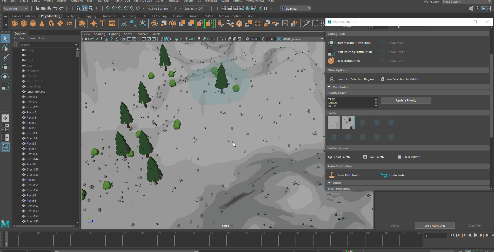

# [WorldPalette](https://vimeo.com/manage/videos/543207619)

 

 

 

**University of Pennsylvania, CIS 660: Advanced Topics in Computer Graphics**

* Helen (Hanyu) Liu
  * [LinkedIn](https://www.linkedin.com/in/hliu20/), [personal website](http://liuhanyu.net/), [Github](https://github.com/helenl9098)
* Gizem Dal
  * [LinkedIn](https://www.linkedin.com/in/gizemdal/), [personal website](https://www.gizemdal.com/)

## Final Presentation Slides (includes video of plugin)

[Google Slides](https://docs.google.com/presentation/d/1byS12n9nsRtoRMZ9JiM3sTMzlNBTkkwF3-9QokZnCsk/edit?usp=sharing)

## Table of Contents  
[Introduction](#introduction)  
[Running & Building Plugin](#build)  
[Features](#features)   
[Future Work](#future-work)   
[Resources](#resources)   

<a name="introduction"/> 

## Introduction

  Procedural methods for generating virtual worlds traditionally pose many challenges for artists and non-experts such as being too unintuitive and reliant on input parameters. Inverse procedural methods combat this by asking the user for examples of expected outputs to infer the inputs, thus making it easier for artists to generate the desired look. Our authoring tool, World Palette, is an inverse procedural tool that takes in selected regions to generate models on the virtual world, and we developed World Palette as a Maya Plugin. The tool expects the user to select regions with 3D meshes, and these selections along with a specified priority order will be the inputs to the program. Our tool will then allow users to save their selection in a slot on a “palette”. Next, the user will pick a saved selection as well as an editing tool such as copy & paste, move, or brush to output meshes onto the virtual world. These editing operations will allow artists to refine the virtual world to their liking while keeping the consistency of the object distribution and avoiding the tedious work of placing individual geometry. Our tool will be geared towards artists in the game and film industry, and we expect basic knowledge of editing or drawing operations. Familiarity with Maya will be beneficial, but actual modeling experience will not be necessary. 
  
World Palette is based on the 2015 SIGGRAPH paper, [_WorldBrush: Interactive Example-based Synthesis of Procedural Virtual Worlds_](https://dl.acm.org/doi/10.1145/2766975) by Emilien A. and others. This paper introduces a novel and interactive way of synthesizing virtual worlds from example arrangements and allows users to edit these worlds as if they’re using a paint “brush” and color “palette”. Their algorithm analyzed selected regions (colors on the palette) and generated pairwise histograms that represented the distribution of objects in the region. With these histograms, they were able to generate geometry using the Metropolis-Hastings sampling method. Users can then apply these distributions onto the world using common painting operations like paint brushing, moving, stretching, copy & pasting, and moving.

As previously mentioned, World Palette is a Maya Plugin, and we used C++ to implement the distribution synthesis/generation algorithms and MEL to display the user interface, visual 3D indications, and scene geometry of the world. A detailed list of our features is found [here](#features).
<a name="build"/> 

## Running & Building Plugin

### Building
To build the plugin, open up the solution in visual studios. Make sure the project properties has the correct Maya library path so the project can find the maya libraries to import and compile. Then, run the program and it will generate a new .mll file on the top level, which you can then import into Maya. **So far we confirmed that our plugin works with Maya versions 2019 and 2020.** We will be updating our documentation accordingly as our plugin functionality is confirmed for older versions.

### Importing
In order to use our tool, the user must first make sure to have the following files and folders in the same directory with each other:
- WorldPalette.mll (the importable Maya plugin file)
- WorldPalette.mel (the MEL script file)
- icons (make sure to not remove any file within this folder)
- scene_objects (make sure to not remove any file within this folder)

To use the plugin, simply open up Maya's plugin manager and import the WorldPalette.mll file. If successful, an extra option called WorldPalette will be added to the top bar in Maya. Expand that option to open up the plugin's GUI. You will also see 4 hidden transform items with names **_tree:Tree_**, **_rock:Rock_**, etc. under the Outliner list on the left. **Do NOT delete these!** These hidden meshes are used for instancing scene geometries while using the plugin.

### Content Creation

All the available editing tools can be accessed from the WorldPalette GUI window (seen on the left image). A terrain is not necessary to be able to use our plugin, but users can import their custom terrains to the scene if desired. Note that we only support OBJ files and the filename must be in format “terrain*.obj”. We provide some example terrains under scene_objects/terrains for users to import into their scenes. Once a terrain is loaded, you cannot load another terrain before deleting the existing terrain. **In order to delete the existing terrain, you must use the _Delete Terrain_ button under Scene/Customization on the GUI menu rather than the Maya delete shortcut.** Using the shortcut instead could result in unexpected behavior.

In order to start off with an example distribution, you can click on the **_Load Default Scene_** button to generate scene objects. If you have terrain in your scene, the plugin will set the altitude of these scene objects accordingly. We provide default scene meshes for users; however, custom meshes in OBJ format can also be imported through the corresponding **Scene/Customization** menu items. Keep in mind that you need to set the transform name of the custom mesh to tree/rock/shrub/grass (depending on the scene object you’re replacing) through the Maya Attribute Editor and re-export it as OBJ before importing the mesh through WorldPalette. Depending on the custom mesh, you might also need to reset construction history, freeze transformations and move the pivot point of your mesh to be at the bottom of the object rather than the center before exporting.

After loading the default scene, you need to create a selection region in order to start sampling distributions and synthesizing new ones. In order to create a selection region, you need to select the **_Radial Selection_** radio button under **Selection/Selection Mode**. This region is not selectable with a mouse click; however, you can adjust its position and width through the corresponding sliders. You can also use the WSAD keys while holding Shift to move the selection region around. If you no longer want to have the selection region, you need to select the **_No Selection_** radio button. **Do NOT delete the selection region by clicking on the corresponding transform item listed in the Outliner!**

Once the user is happy with their resulting world, they can disable the selection region and export the scene file as they like. Before exporting, the user may also assign material to the terrain and other scene objects and place lights in the scene. You can find some example results we were able to create with WorldPalette, rendered with Arnord renderer plugin, in this repository under the **_renders_** folder.

<a name="features"/> 

## Features

### **Maya GUI**

  * Added to the top Maya options bar when plugin is loaded
  * Option to toggle selection region
  * Sliders and key binds for moving the selection region
  * Sliders for adjusting the selection region width
  * Buttons for all our editing operations and their undo functionality
      * Buttons are appropriately grey-out when unable to be used or if their use is inappropriate in the given context
      * All of our editing operations are listed in another section below
  * Button to focus on the currently selected region in the Maya viewport
  * Button to save the currently selected region in an available palette slot
  * Palette with our saved distributions
      * Small thumbnail pictures of our saved selection
      * Selectable, with UI to indicate which palette is unselected, and which are empty
  * Hierarchy/stack to change the priority order for generation
  * Buttons to save, load, and clear the palette
  * Buttons to toggle brush & eraser tool
  * Slider to change brush width
  * Buttons to add and load custom terrains or scene objects for a category
  * Brings up file selection window
  * All our buttons have appropriate icons and are organized in collapsable groups, allowing the GUI or parts of the GUI to be hidden, expanded, or resized.

### **Selecting, Saving, & Generating Geometry**
  * Selecting
      * Users can select a region and either save it to the palette or directly select an editing operation, and our program will automatically find the objects in the selection along with their category, layer, and datatype.
      * Pairwise histograms are calculated based on the priority order given in the GUI. These pairwise histograms use radial distribution to find the relationship between pairs of categories, accounting for all objects with that category. 
  * Saving
      * When a region is saved, its pairwise histograms and other parameters are saved in a palette, which can be accessed later.
  * Generating
      * Scene geometry is generated consistent with the original selected region’s distribution using the Metropolis-Hastings Sampling algorithm. This accounts for all categories in the priority order.
      * Our program automatically outputs the resultant scene geometry into Maya, taking into account terrain height and surface normals
### **Editing Operations**

Paste |  Brush
:---: | :---:
 | 

Move | Resize
:---: | :---:
 | 

  * Paste & Undo Paste
    * Clears everything currently in the selected region and generates new geometry based on the selected palette distribution
    * Undo: clears all newly generated geometry and brings back any geometry deleted by the paste operation
  * Clear & Undo Clear
    * Clears all geometry in the currently selected region
    * Undo: brings back all geometry deleted by clear
  * Move & Undo Move
    * Once toggled on, moves objects in the currently selected region using the translate slider or key binds. Object relationship is maintained, but objects adjust to terrain height and surface normal. Passing over other objects on the way will neither delete or move those objects. 
    * Undo: moves the objects back to their original location.
  * Resize & Undo Resize
    * Once toggled on, resizes the currently selected region using the width slider. If resized outwards, any geometry currently in the way will be deleted and new geometry will be created consistent with the distribution of the selected region (Note: If you are resizing outwards and the current selected region is smaller than the original selection at toggle, then the original geometry will be brought back instead of generating new ones). If resized downwards, any geometry deleted by previous resize will be brought back (if the region was resized outwards before), and any geometry that was previously but no longer in the selected region will be deleted.
    * Undo: Returns the currently selected region to its original size, bringing back or deleting any geometry if necessary. 
  * Brush & Undo Brush
    * Once toggled, click and drag, and any geometry currently in the brush stroke path will be deleted and then geometry consistent with the selected palette distribution will be generated inside the brush stroke. 
    * Undo: clears all newly generated geometry and brings back any geometry deleted by the brush operation
  * Eraser & Undo Eraser
    * Once toggles, click and drag, and any geometry currently in the brush stroke path will be deleted.
    * Undo: Brings back all geometry cleared by the eraser operation. 
### **Terrain & Custom OBJs**
  * Terrain
    * Generated scene geometry adapts to terrain height
    * Selection region circle follows terrain natural height
    * Custom terrain can be loaded using our GUI
  * Custom Objs
    * We have the option to use different models to represent each category. All objects of the category will be replaced with the newly imported obj. 
### **Usability**
  * Palette Saving, Loading & Clearing
    * Palette can be saved by pressing a button. This automatically exports the distribution information of every currently filled slot of the palette, overriding the last save. (Thus, only the most recent saved palette will be kept)
    * The last saved palette can be automatically loaded in at any point by pressing load, even when the plugin is imported again into a new project. The preview thumbnails are also saved and loaded.
    * The palette can be cleared at any point. This doesn’t affect the last save.
 
<a name="future-work"/> 

## Future Work

As future work, some improvements we considered include:
* Visualizing the brush/eraser stroke path so the user can see where the geometry should be generated or even see the geometry as they click and drag
* User defined categories
* More than one OBJ mesh assigned for each category, with a user defined probability of choosing between the two when generating objs of that category
* Built-in terrain deformation so the terrain height is considered and outputted during generation. This will allow us to output rivers, lakes, islands, and hills.
* Clicking and dragging to move the selection region
* Advanced scene structures such as roads and river networks
* Multiple Undos (instead of just the most recent change)
* Adding randomness to our output (which can be toggled off) so the generating geometry looks more natural
* Other attributes to consider when analyzing and generating distributions such as rotation/orientation, object surface normals, color, texture, environment attributes (temperature, moisture, etc.) and population density
* Editing objects only of a certain layer (Example: only moving the vegetation in the currently selected region)
* Other selection region shapes like a polygon made similar to a lasso tool
* Other editing operations
   * Rotating a whole region
   * Circle of influence/gradient between two distributions
   * Fill (fills entire region with one category)
   * Strict copy & paste (everything in the region is kept, as opposed to generating new geometry)

<a name="resources"/> 

## Resources

We started the implementation of our plugin from scratch without using any third party software. Our default environment assets are taken from [Lowpoly Nature Pack](https://www.cgtrader.com/free-3d-models/exterior/landscape/low-poly-trees-grass-and-rocks-lite). Our example custom scene uses [Macedonian Pine Tree](https://www.cgtrader.com/free-3d-models/plant/conifer/conifer-macedonian-pine), [PBR Game-Ready Rock](https://www.cgtrader.com/free-3d-models/scanned/various/rock-pbr-game-ready), [Curry Leaf Tree](https://www.cgtrader.com/free-3d-models/plant/other/xfrogplants-curry-leaf-tree) and [Seamless Grass Terrain Texture](https://www.pinterest.com/pin/851672979503915446/).

